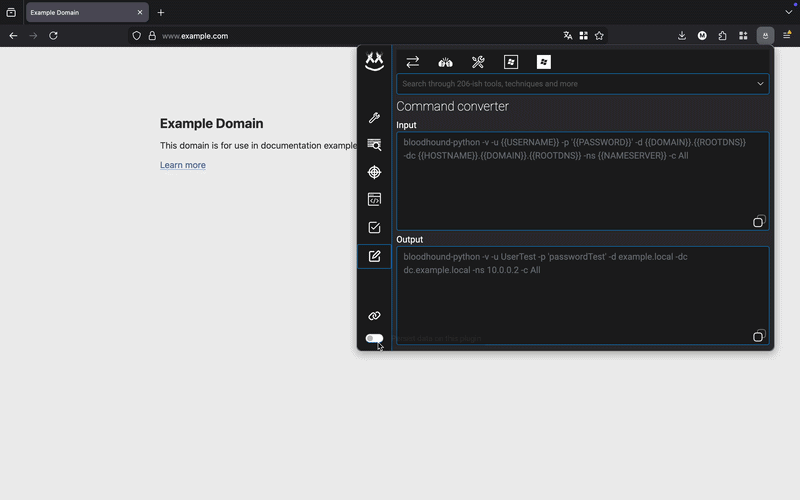

# Hack-mate - your pentest assistant

  
  

      
> Plugin knowledge level: **OSCP**

Hack-mate is a browser plugin that offers over 35 functional tabs organized into seven main categories, covering general utilities (encoding/decoding, hashing, code highlighting), offensive tools (payloads, transfer methods, well-structured checklists, command references) and much much more.

>Hack-mate is designed around a simple workflow: 
> 
> 1. Toggle the 'persist data on this plugin' button (left-bottom -  )
> 2. Input your **pentest parameters** once in Hack-mate home (left-top - )
> 3. Click on the **update pentest parameters** button (within Hack-mate home - )
> 4. Hack-mate **updates your parameters throughout every relevant tab** (customized commands, customized payloads, customized checklists and more).

**First impression**

## Table of Contents

- [Hack-mate home](#hack-mate-home)
- [Tab 1 — General tooling](#tab-1--general-tooling)
- [Tab 2 — Enumeration tooling](#tab-2--enumeration-tooling)
- [Tab 3 — Exploit assistant](#tab-3--exploit-assistant)
- [Tab 4 — Shell assistant](#tab-4--shell-assistant)
- [Tab 5 — Checklist assistant](#tab-5--checklist-assistant)
- [Tab 6 — Useful commands](#tab-6--useful-commands)
- [Tab 7 — Resources](#tab-7--resources)

## Hack-mate home

Hack-mate Home serves as the central hub of the plugin. Enter your pentest parameters once — such as target IP, port, and username — and they will automatically update throughout the entire plugin, from reverse shells to tool syntaxes and checklists. From this single overview, you can also quickly navigate to any tab within Hack-mate.
###  Impression

## Tab 1 — General tooling
The general tooling tab offers a variety of utilities for encoding/decoding, hashing, code obfuscation, formatting and highlighting. These tools can be used for quick transformations, generating payloads, or simply improving the readability of code snippets.

| Subtab | Description |
|---|---|
| Encoding & Decoding | Base64, URI, Unicode, Hex, Decimal, HTML (encode & decode) |
| Hashing | MD5, BCRYPT, NTLMv1, SHA1/224/256/384/512 |
| Code Obfuscation | JavaScript obfuscation via obfuscator.io or minimal chars |
| Code Formatter | HTML, XML, JSON, CSS, JavaScript, SQL, PostgreSQL |
| Code Highlighter | Syntax highlighting with screenshot-to-clipboard support |

###  Impression

## Tab 2 — Enumeration tooling
The enumeration tooling tab provides various tools to assist with the reconnaissance and information-gathering phases of a pentest. From crawling and visualizing site structures to extracting hidden data and building advanced search queries, these tools are designed to help you uncover as much information as possible about your target.

| Subtab | Description                                                                |
|---|----------------------------------------------------------------------------|
| Website Spider | Crawl the current page and visualize the site tree and forms on every page |
| Toolbox | Highlight forms, inputs, hidden fields; extract comments, URLs, headers    |
| Iframe Checker | Test whether a target URL can be embedded in an iframe                     |
| Google Dork Query Builder | Build advanced Google search queries (site:, inurl:, filetype:, etc.)      |
| Monitor | Capture postMessage events and track cookie changes in real time           |

###  Impression

## Tab 3 — Exploit assistant
The exploit assistant tab contains a variety of cheat sheets, payloads and bypass techniques for common web vulnerabilities. It serves as a quick reference guide during the exploitation phase, allowing you to easily find and customize payloads for your specific pentest parameters.

| Subtab | Description |
|---|---|
| XSS | Cheat sheet and exploitation payloads for Cross-Site Scripting |
| SQL Injection | Cheat sheet and exploitation payloads for SQL Injection |
| Command Injection & File Inclusion | Cheat sheet for command injection and LFI/RFI techniques |
| File Upload | Bypass techniques and malicious file upload payloads |
| Forgery (SSRF) | SSRF scripts and bypass techniques |

###  Impression

## Tab 4 — Shell assistant

The shell assistant tab provides a collection of reverse shell and bind shell payloads for various programming languages and tools, as well as file transfer methods. You can easily customize the payloads with your pentest parameters and copy them to your clipboard for quick use during the exploitation phase.

| Subtab | Description |
|---|---|
| Reverse Shells | Generate reverse shell commands per language / tool |
| Bind Shells | Generate bind shell commands per language / tool |
| Transfer Methods | File transfer commands with configurable filepath and filename |

###  Impression

## Tab 5 — Checklist assistant

The checklist assistant tab offers a variety of well-structured checklists for different phases and aspects of a pentest, including OSINT, protocol-specific checks, Linux and Windows privilege escalation, Active Directory, post-exploitation and more. These checklists can help guide your pentest process and ensure that you don't miss any important steps or techniques.

| Subtab | Description |
|---|---|
| OSINT | Web and dark web reconnaissance checklists |
| Protocol | Non-web protocols, general web pentest, and Web API checklists |
| Linux OS | Linux privilege escalation checklist |
| Windows OS | Windows privesc, Active Directory, and post-exploitation checklists |
| I'm st\*ck | General "unstuck" checklist for when you don't know where to go next |

###  Impression

## Tab 6 — Useful commands

The useful commands tab contains a collection of commonly used commands and techniques for various pentesting scenarios, including command templates that can be auto-populated with your pentest parameters. It serves as a quick reference guide for command-line operations during all phases of a pentest.

| Subtab | Description |
|---|---|
| Command Converter | Auto-populate command templates using your pentest parameters |
| Linux vs Windows | Side-by-side equivalent command reference |
| Pentesting tools & techniques | Offensive tools and techniques explained |
| AD & Windows pentesting tools | Active Directory and Windows tooling reference |
| AD pentesting techniques | Active Directory attack technique explanations |

###  Impression

## Tab 7 — Resources
The resources tab contains a list of usefull resources for pentesters, including cheat sheets, tools and more. It serves as a quick reference guide to find nice resources for various pentesting needs.

## Additional info
- Please note that this plugin is still under active development. While occasional issues may occur, I am continuously maintaining and improving it. Updates will be released regularly as new insights and improvements are made.
- The code may not be the cleanest, but it does what it should.
- I have taken notes into this plugin until the level of OSCP+ (as of 28-2-2026). The next update will contain cleaner code blocks, more structured command lists, expanded commands with a knowledge level of up to OSEP.
